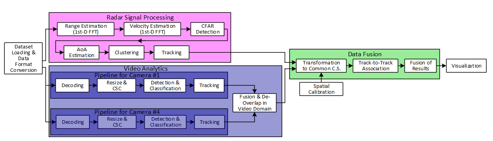
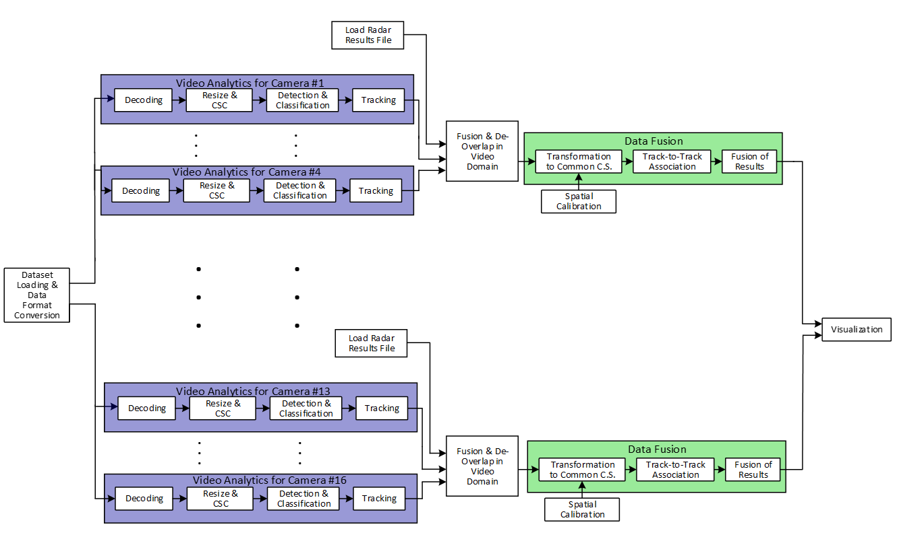

# Sensor Fusion for Traffic Management

A multi-modal reference implementation for traffic management, enabling partners to blend camera and radar sensor inputs to accurately monitor traffic conditions.

## Overview

Unlock the future of traffic management with the Intel® software reference implementation of the Metro AI Suite Sensor Fusion for Traffic Management. This implementation integrates AI inferencing with sensor fusion technology, utilizing multi-modal sensors such as cameras and radars to deliver unparalleled performance. A traffic management system leveraging the fusion of camera and radar sensors offers superior accuracy and reliability over camera-only solutions. Cameras capture high-resolution visual data, while radar sensors precisely measure speed and distance, even under challenging conditions like fog, rain, or darkness. This integration ensures a more robust and comprehensive approach to traffic monitoring and decision-making, enhancing overall system performance and safety. This software reference implementation features four pipelines tailored to distinct sensor fusion use cases: one camera paired with one mmWave radar (1C+1R), four cameras paired with four mmWave radars (4C+4R), two cameras paired with one mmWave radar (2C+1R) and sixteen cameras paired with four mmWave radars (16C+4R).  

Discover the key features that set our implementation apart and see how it meets the sensor fusion requirements of your intelligent traffic management solution. For a highly performant and cost-efficient solution, leverage the  Intel-powered [Certified AI Systems ](https://www.intel.com/content/www/us/en/developer/topic-technology/edge-5g/edge-solutions/hardware.html?f:guidetm392b07c604bd49caa5c78874bcb8e3af=%5BIntel%C2%AE%20Edge%20AI%20Box%5D). Whether you are developing a comprehensive traffic management system or showcasing your hardware platform's capabilities, this reference implementation serves as the perfect foundation. Contact us today to elevate your traffic management solutions to the next level.  

## How It Works

This reference implementation enables the development of a high-performance, Intel-based® Intelligent Traffic Solution. The end-to-end pipeline of this software reference implementation includes the following major workloads, as shown in the figure below: 

- Dataset loading and data format conversion
- Radar signal processing
- Video analytics
- Data fusion
- Visualization
  

Each pipeline is deployed on a single Intel® SoC processor, providing the necessary heterogeneous compute capabilities from Intel Core™ processors and integrated GPU. The implementation includes video analytics optimized by the Intel® Distribution of OpenVINO™ Toolkit, radar signal processing accelerated by Intel® oneMKL, data fusion, and visualization. Key performance indicators, such as throughput and processing latency, significantly surpass current market standards. To maximize performance on Intel® processors, we optimized this SW RI using Intel software toolkits and open-source libraries.

Use case #1: 1C+1R Pipeline

Use case #2: 4C+4R Pipeline

Use case#3: 2C+1R 

Use case#4: 16C+4R 

Following are the four demo configurations. Please refer to the [Get Started Guide](./Get-Started-Guide.md) for more instructions on deploying services on bare metal.  

### Demo for 1C+1R

Use case #1: 1C+1R running on Intel® Celeron® Processor 7305E 

### Demo for 4C+4R

Use case #2: 4C+4R running on Intel® Core™ Ultra 7 Processor 165H 

### Demo for 2C+1R

Use case #3: 2C+1R running on Intel® Celeron® Processor 7305E 

### Demo for 16C+4R

Use case #4: 16C+4R running on Intel® Core™ i7-13700 and Intel® Arc™ A770 Graphics 

## Key Features

* Powerful and scalable CPU, built-in GPU (iGPU) configurations that deliver heterogeneous computing capabilities for sensor fusion-based AI inferencing. 

* Low power consumption package with a wide temperature range, compact fanless design, and enhanced vibration resistance. 

* Processors designed for industrial and embedded conditions, ensuring high system reliability. 

* Optimized software reference implementation based on open-source code to support performance evaluation, rapid prototyping, and quick time-to-market. 

* Rugged and compact PC design to withstand harsh in-vehicle environmental conditions. 

## Benefits

* **Enhanced AI Performance**: Achieve superior AI performance with our recommended optimization techniques, rigorously tested on industry-leading AI models and sensor fusion workloads. 

* **Accelerated Time to Market**: Speed up your development process by leveraging our pre-validated SDK and Intel-powered qualified AI Systems, ensuring a quicker path from concept to deployment. 

* **Cost Efficiency**: Lower your development costs with royalty-free developer tools and cost-effective hardware platforms, ideal for prototyping, development, and validation of edge AI traffic solutions. 

* **Simplified Development**: Reduce complexity with our best-known methods and streamlined approach, making it easier to build an intelligent traffic management system.  

##	System Requirements

- Hardware requirements

    - Platform

        - Intel® Celeron® Processor 7305E (1C+1R/2C+1R usecase)
        - Intel® Core™ Ultra 7 Processor 165H (4C+4R usecase)

        - Intel® Core™ i7-13700 and Intel® Arc™ A770 Graphics (16C+4R usecase)

    - BIOS setting

        - MTL

            | Setting                                          | Step                                                         |
            | ------------------------------------------------ | ------------------------------------------------------------ |
            | Enable the Hidden BIOS Setting in Seavo Platform | "Right Shift+F7" Then Change Enabled Debug Setup Menu from [Enabled] to [Disable] |
            | Disable VT-d in BIOS                             | Intel Advanced Menu → System Agent (SA) Configuration → VT-d setup menu → VT-d<Disabled>     Note: If VT-d can’t be disabled, please disable Intel Advanced Menu → CPU Configuration → X2APIC |
            | Disable SAGV in BIOS                             | Intel Advanced Menu → [System Agent (SA) Configuration]  →  Memory configuration →  SAGV <Disabled> |
            | Enable NPU Device                                | Intel Advanced Menu → CPU Configuration → Active SOC-North Efficient-cores <ALL>    Intel Advanced Menu → System Agent (SA) Configuration → NPU Device <Enabled> |
            | TDP Configuration                                | SOC TDP configuration is very important for performance. Suggestion: TDP = 45W. For extreme heavy workload, TDP = 64W  ---TDP = 45W settings: Intel Advanced → Power & Performance → CPU - Power Management Control → Config TDP Configurations → Power Limit 1 <45000>  ---TDP = 64W settings: Intel Advanced → Power & Performance → CPU - Power Management Control → Config TDP Configurations →  Configurable TDP Boot Mode [Level2] |

        - RPL-S+A770

            | Setting                  | Step                                                         |
            | ------------------------ | ------------------------------------------------------------ |
            | Enable ResizeBar in BIOS | Intel Advanced Menu -> System Agent (SA) Configuration -> PCI Express Configuration -> PCIE Resizable BAR Support <Enabled> |

    

- Software requirements

    | Software           | Version                |
    | ------------------ | ---------------------- |
    | Intel  OpenVINO    | 2024.6.0               |
    | Intel  oneMKL      | 2025.1.0               |
    | NEO OpenCL         | Release/23.22.26516.25 |
    | cmake              | 3.22.1                 |
    | boost              | 1.83.0                 |
    | spdlog             | 1.8.2                  |
    | thrift             | 0.18.1                 |
    | gRPC               | 1.58.1                 |
    | zlib               | 1.2.11                 |
    | oneAPI Level  Zero | 1.17.19                |

## Get Started

- [Get-Started-Guide.md](./Get-Started-Guide.md)
- [Advanced-User-Guide.md](./Advanced-User-Guide.md)
- [APIs.md](./APIs.md)

##	Getting Help

- [FAQ.md](./FAQ.md)

